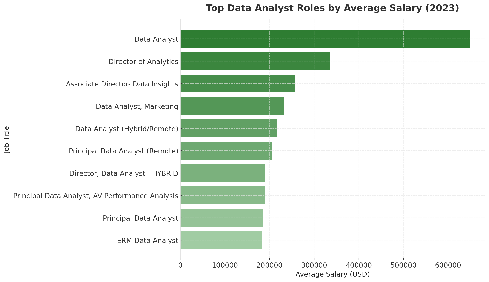

# Introduction
📊 Explore the data job market with a focus on Data Analyst roles!
This project uncovers 💰 top-paying positions, 🔥 the most in-demand skills, and 📈 the intersection of high demand and high salary in data analytics.

🔍 Want to see the SQL queries? Check them out here: [project_sql folder](/project_sql/).

# Background
Driven by a goal to better understand and navigate the data analyst job market, this project was created to identify the top-paying and most in-demand skills—making it easier for others to find the most rewarding career opportunities.

The data comes from the course I have taken [SQL course](http://lukebarousse.com/sql) and includes valuable insights on job titles, salaries, locations, and essential skills.

### The questions I wanted to answer through my SQL queries were:
1. What are the top-paying data analyst jobs?
2. What skills are required for these top-paying jobs?
3. What skills are most in demand for data analysts?
4. Which skills are associated with higher salaries?
5. What are the most optimal skills to learn?

# Tools I used
For my deep dive into the data analyst job market, I harnessed the power of several key tools:

- **SQL**: The backbone of my analysis, allowing me to query the database and unearth critical insights.
- **PostgreSQL**: The chosen database management system, ideal for handling the job posting data.
- **Visual Studio Code**: My go-to for database management and executing SQL queries.
- **Git & GitHub**: Essential for version control and sharing my SQL scripts and analysis, ensuring collaboration and project tracking.

# The Analysis
Each query for this project aimed at investigating specific aspects of the data analyst job market. Here’s how I approached each question:

### 1. Top Paying Data Analyst Jobs
To identify the highest-paying roles, I filtered data analyst positions by average yearly salary and location, focusing on remote jobs. This query highlights the high paying opportunities in the field.

``` sql
SELECT
    j.job_id,
    j.job_title,
    j.job_location,
    j.job_schedule_type,
    j.salary_year_avg,
    j.job_posted_date,
    c.name AS company_name
FROM
    job_postings_fact AS j
    LEFT JOIN company_dim AS c ON j.company_id = c.company_id
WHERE
    job_title_short = 'Data Analyst' AND
    job_location = 'Anywhere' AND
    salary_year_avg IS NOT NULL
ORDER BY
    salary_year_avg DESC
LIMIT 10;
```
Here's the breakdown of the top data analyst jobs in 2023:
- Top salary: Mantys offered the highest-paying data analyst role in 2023 at $650K, well above the market average.
- Leadership roles: Director-level positions at Meta and AT&T paid between $250K–$330K, showing strong demand for analytics leaders.
- Principal analysts: Senior and principal roles across healthcare, fintech, and telecom averaged around $185K–$205K.
- Work setup: All top roles were remote or hybrid, highlighting the continued flexibility in high-level data analytics jobs.

Bar chart visualizing the top 10 highest-paying data analyst roles in 2023; this chart was generated by ChatGPT from SQL query results based on job titles.

### 2. Skills for Top Paying Jobs
To understand what skills are required for the top-paying jobs, I joined the job postings with the skills data, providing insights into what employers value for high-compensation roles.

``` sql
WITH top_10_paying_jobs AS(
    SELECT
        j.job_id,
        j.job_title,
        j.salary_year_avg,
        c.name AS company_name
    FROM
        job_postings_fact AS j
        LEFT JOIN company_dim AS c ON j.company_id = c.company_id
    WHERE
        job_title_short = 'Data Analyst' AND
        job_location = 'Anywhere' AND
        salary_year_avg IS NOT NULL
    ORDER BY
        salary_year_avg DESC
    LIMIT 10
)

SELECT
    tp.job_id,
    tp.job_title,
    tp.salary_year_avg,
    tp.company_name,
    sd.skills
FROM 
    top_10_paying_jobs AS tp
INNER JOIN skills_job_dim AS sj ON tp.job_id = sj.job_id
INNER JOIN skills_dim AS sd ON sj.skill_id = sd.skill_id
ORDER BY tp.salary_year_avg DESC
```
Here's the breakdown of the most demanded skills for the top 10 highest paying data analyst jobs in 2023:

- **SQL** is leading with a bold count of 8.
- **Python** follows closely with a bold count of 7.
- **Tableau** is also highly sought after, with a bold count of 6. Other skills like **R**, **Snowflake**, **Pandas**, and **Excel** show varying degrees of demand.


Bar chart showing the most common skills in the top 10 highest-paying Data Analyst roles (2023); generated by ChatGPT from SQL query results.
### 3. In-Demand Skills for Data Analysts
This query helped identify the skills most frequently requested in job postings, directing focus to areas with high demand.

``` sql
SELECT 
	sd.skills,
	COUNT(sj.job_id) AS demand_count
FROM 
    job_postings_fact AS jp
   
INNER JOIN skills_job_dim AS sj ON jp.job_id = sj.job_id
INNER JOIN skills_dim AS sd ON sj.skill_id = sd.skill_id
WHERE 
	jp.job_title_short = 'Data Analyst' AND
	jp.job_work_from_home = TRUE
GROUP BY sd.skills
ORDER BY demand_count DESC
LIMIT 5
```

Here’s the breakdown of the most in-demand skills for data analysts in 2023:

* **SQL** (7,291) and **Excel** (4,611) remain essential, forming the foundation of data querying and reporting.
* **Python** (4,330) is key for automation and advanced analytics, solidifying its role in modern data workflows.
* **Tableau** (3,745) and **Power BI** (2,609) highlight the importance of visualization and business intelligence.


### 4. Skills Based on Salary
Exploring the average salaries associated with different skills revealed which skills are the highest paying.
``` sql
SELECT 
	sd.skills,
	ROUND(AVG(jp.salary_year_avg)) AS average_salary
FROM 
    job_postings_fact AS jp
   
INNER JOIN skills_job_dim AS sj ON jp.job_id = sj.job_id
INNER JOIN skills_dim AS sd ON sj.skill_id = sd.skill_id
WHERE 
	jp.job_title_short = 'Data Analyst' AND
	jp.job_work_from_home = TRUE 
GROUP BY sd.skills
Having AVG(jp.salary_year_avg) IS NOT NULL
ORDER BY average_salary DESC
LIMIT 25
```
Here is a breakdown of the results for top paying skills (focused on data analyst jobs, remote jobs):

- Big data and machine learning skills like **PySpark**, **DataRobot**, and **Pandas** command the highest salaries, showing the value of advanced analytics expertise.
- Development and automation tools such as **GitLab**, **Kubernetes**, and **Airflow** highlight strong demand for analysts skilled in data engineering workflows.
- Cloud technologies like **Databricks**, **GCP**, and **Elasticsearch** emphasize the growing importance of scalable, cloud-based analytics environments.


Bar chart displaying the top 10 highest-paying data analyst skills based on average salary; generated by ChatGPT using SQL query results.

### 5. Most Optimal Skills to Learn
Combining insights from demand and salary data, this query aimed to pinpoint skills that are both in high demand and have high salaries, offering a strategic focus for skill development.

```sql
-- Identifies skills in high demand for Data Analyst roles:
WITH demanded_skills AS (
    SELECT 
        sj.skill_id,
        sd.skills,
        COUNT(sj.job_id) AS demand_count
    FROM 
        job_postings_fact AS jp
    
    INNER JOIN skills_job_dim AS sj ON jp.job_id = sj.job_id
    INNER JOIN skills_dim AS sd ON sj.skill_id = sd.skill_id
    WHERE 
        jp.job_title_short = 'Data Analyst' AND
        jp.job_work_from_home = TRUE AND
        jp.salary_year_avg IS NOT NULL
    GROUP BY sj.skill_id, sd.skills
),
-- Skills with high average salaries for Data Analyst roles:
 paying_skills AS (
    SELECT 
        sj.skill_id,
        sd.skills,
        ROUND(AVG(jp.salary_year_avg)) AS average_salary
    FROM 
        job_postings_fact AS jp
    
    INNER JOIN skills_job_dim AS sj ON jp.job_id = sj.job_id
    INNER JOIN skills_dim AS sd ON sj.skill_id = sd.skill_id
    WHERE 
        jp.job_title_short = 'Data Analyst' AND
        jp.job_work_from_home = TRUE AND
        jp.salary_year_avg IS NOT NULL
    GROUP BY sj.skill_id, sd.skills
)
-- Return high demand and high salaries for 10 skills:
SELECT
    demanded_skills.skill_id,
    demanded_skills.skills,
    demanded_skills.demand_count,
    paying_skills.average_salary
FROM
    demanded_skills
INNER JOIN paying_skills ON paying_skills.skill_id = demanded_skills.skill_id
WHERE demanded_skills.demand_count > 10
ORDER BY
    paying_skills.average_salary DESC,
    demanded_skills.demand_count DESC
LIMIT 25;
```

Here's a breakdown of the most optimal skills for Data Analysts in 2023: 

- **Python** and **R** are the most in-demand and widely used programming skills, combining high demand with strong salaries around $100K.
- **Cloud and big data tools** such as **Snowflake**, **Azure**, **AWS**, and ***Hadoop*** offer both high pay and relevance, reflecting the shift toward scalable data solutions.
- Visualization and BI tools like **Tableau** and **Looker** remain essential for translating complex data into actionable insights.
- **Database** and **integration technologies** such as **Oracle** and **SQL Server** continue to provide solid career value through data management expertise.


Bar and line chart visualizing the top 10 optimal skills for data analysts, showing both demand and average salary; generated by ChatGPT from SQL query results.


# What I learned

Through this project, I’ve supercharged my SQL skills with powerful techniques:

* **🧩 Advanced Query Building:** Learned to craft complex SQL queries, join tables efficiently, and use WITH clauses for clean and dynamic temporary tables.
* **📊 Data Aggregation Mastery:** Became proficient with GROUP BY and aggregate functions like COUNT() and AVG(), transforming raw data into meaningful summaries.
* **💡 Analytical Problem-Solving:** Enhanced my ability to approach real-world data challenges, translating analytical questions into clear, insightful SQL solutions.

# Conclusions

### Insights

The analysis revealed several key takeaways:

1. **Top-Paying Data Analyst Jobs**: Remote data analyst positions show a broad salary range, with the highest reaching an impressive $650,000.
2. **Skills for Top-Paying Jobs**: Top-paying roles consistently emphasize advanced SQL expertise, marking it as a crucial skill for maximizing earnings.
3. **Most In-Demand Skills**: SQL also tops the list in demand across the job market, making it indispensable for aspiring data analysts.
4. **Skills with Higher Salaries**: Specialized tools like SVN and Solidity correlate with higher average salaries, reflecting the premium placed on niche technical knowledge.
5. **Optimal Skills for Job Market Value**: SQL stands out as both highly demanded and well-compensated, making it one of the most strategic skills to master for strong job market positioning.

### Closing Thoughts

This project strengthened my SQL proficiency and deepened my understanding of the data analyst job landscape. The insights gained help identify which skills to prioritize for career advancement. By focusing on high-demand and high-paying skills, aspiring analysts can stand out in a competitive market. Ultimately, this analysis underscores the ongoing need for continuous learning and adaptation in the ever-evolving field of data analytics.

